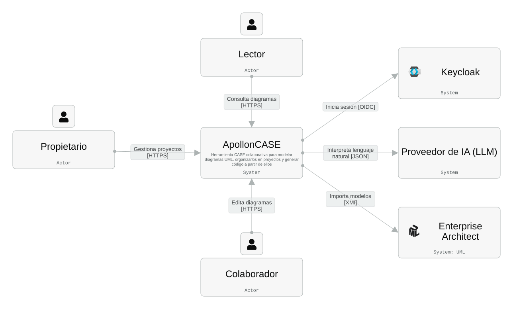

# ApollonCASE

Base para construir una herramienta CASE propia sobre [Apollon](https://github.com/ls1intum/Apollon), el editor UML de código abierto de TUM (Applied Education Technologies). Este repositorio reúne únicamente los componentes *standalone* de Apollon (editor, design system, webapp y servidor de colaboración) para extenderlos con nuevas funciones: proyectos, usuarios y permisos, generación de código y modelado asistido.

> El código, los comentarios de código y la documentación OpenAPI se mantienen en inglés. La documentación del repositorio está en español.

## Estructura del repositorio

| Carpeta | Paquete | Descripción |
| --- | --- | --- |
| [`library/`](library/README.md) | `@tumaet/apollon` | Editor UML embebible (13 tipos de diagrama, colaboración Yjs, exportación). |
| [`packages/ui/`](packages/ui/README.md) | `@tumaet/ui` | Design system compartido (Base UI + Tailwind v4). |
| [`webapp/`](webapp/README.md) | `@tumaet/webapp` | Aplicación web (React + Vite) que envuelve el editor: rutas, persistencia, compartición, historial de versiones. |
| [`services/diagrams-backend/`](services/diagrams-backend/README.md) | `@tumaet/server` | Servidor de Apollon (Hono + Redis): API de diagramas, versiones, exportación y relay WebSocket de colaboración. |
| [`services/extension-backend/`](services/extension-backend/README.md) | — | **Por construir.** Backend Spring Boot + PostgreSQL con las nuevas funciones (ver [Roadmap](#roadmap-de-extensión)). |
| [`docker/`](docker) | — | Archivos Docker Compose (`compose.local*.yml` en uso; `compose.app/db/proxy.yml` son de producción heredados de Apollon y aún no se usan). |
| [`scripts/`](scripts/README.md) | — | Scripts de lanzamiento para Docker y desarrollo local (bash y PowerShell). |
| `nginx.conf` | — | Configuración de nginx de la imagen Docker de la webapp. |

El repositorio es un monorepo de **npm workspaces** (`library`, `packages/ui`, `webapp`, `services/diagrams-backend`). Apollon original usa pnpm; aquí se usa npm y los `catalog:` de pnpm se sustituyeron por versiones fijas en cada `package.json`.

## Requisitos

- Node.js ≥ 24.15 y npm ≥ 11
- Docker con Docker Compose v2

## Puesta en marcha

Desde cualquier directorio (los scripts se posicionan solos en la raíz del repositorio):

```bash
# Linux / macOS / Git Bash
./scripts/docker-up.sh     # stack completo en Docker (build + up)
./scripts/dev.sh           # desarrollo local con hot-reload
```

```powershell
# Windows
.\scripts\docker-up.ps1
.\scripts\dev.ps1
```

| Modo | Webapp | API | WebSocket | Redis |
| --- | --- | --- | --- | --- |
| Docker (`docker-up`) | http://localhost:8080 | http://localhost:8000 | ws://localhost:4444 | localhost:6379 |
| Desarrollo (`dev`) | http://localhost:5173 | http://localhost:8000 | ws://localhost:4444 | localhost:6379 |

- `docker-down` detiene y elimina el stack de Docker (proyecto Compose `apolloncase`).
- `dev` levanta (o reutiliza) solo Redis en Docker (proyecto `apolloncase-dev-db`) y ejecuta backend y webapp en el host. Ctrl+C detiene backend y webapp; Redis sigue corriendo.

Detalle completo en [scripts/README.md](scripts/README.md).

## Comandos habituales

Desde la raíz del repositorio:

```bash
npm install                                              # instala todos los workspaces
npm run build --workspace=@tumaet/apollon                # compila el editor (dist/)
npm run build --workspace=@tumaet/webapp                 # bundle de producción de la webapp
npm run build --workspace=@tumaet/server                 # compila el backend
npm run test  --workspace=@tumaet/apollon                # pruebas de cada paquete
npm run storybook --workspace=@tumaet/webapp             # Storybook (editor + @tumaet/ui) en :6006
```

## Arquitectura objetivo

`services/diagrams-backend` **no se modifica** y no tiene autenticación: conocer el identificador de un diagrama basta para leerlo, escribirlo, borrarlo o unirse a su sala de colaboración. Por eso, cuando existan usuarios y permisos, quedará en una red privada y todo el acceso pasará por `services/extension-backend`, que actuará como puerta de entrada única.

### Diagramas C4

**Contexto**: ApollonCASE, sus usuarios y los sistemas externos.



**Contenedores**: la webapp solo habla con Keycloak y con `extension-backend`; `diagrams-backend` queda detrás de esta.


**Componentes de `extension-backend`**:


El modelo C4 de ApollonCASE (contexto, contenedores y componentes) se documenta en [docs/architecture](docs/architecture): `model.json` y `llms.txt` son exports de IcePanel filtrados a este proyecto. Para actualizarlos, vuelve a exportar desde IcePanel y filtra de nuevo lo que no pertenezca a ApollonCASE.

El análisis de alternativas y sus tradeoffs está en [services/extension-backend/README.md](services/extension-backend/README.md#exposición-de-la-api-de-diagramas). Los compose actuales aún no aíslan el backend; eso llegará con `extension-backend`.

## Roadmap de extensión

Funciones que se buscan añadir sobre Apollon:

1. **Autenticación con Keycloak.** Inicio de sesión en la webapp mediante OpenID Connect contra Keycloak. El token identifica al usuario ante `extension-backend`, la puerta de entrada única a los diagramas (REST y WebSocket). Incluye cierre de sesión, sesión persistente y, por definir, un acceso anónimo restringido.
2. **Proyectos como contenedor de diagramas.** Nuevo modelo *Proyecto → Diagramas*: crear, renombrar, archivar y eliminar proyectos, con cada diagrama perteneciendo a un proyecto. Está por decidir si los diagramas actuales (locales o compartidos por enlace) se migran o se mantienen como "sueltos".
3. **Permisos y colaboración por usuario.** Evolución del modelo de Apollon (propietario, colaborador y solo lectura) hacia permisos **por usuario y por proyecto**, con herencia hacia los diagramas, posibilidad de sobrescribirlos por diagrama, invitaciones y revocación. El gateway aplica el permiso en REST y en el proxy WebSocket (descarta ediciones de lectores y cierra sockets al revocar) sin tocar el relay de Apollon.
4. **Generación de un proyecto Spring Boot desde diagramas de clase.** A partir de uno o varios diagramas de clase, generar un proyecto ejecutable con entidades JPA, repositorios, servicios, controladores REST, DTOs y validaciones, migraciones, configuración y **documentación OpenAPI**, siguiendo las convenciones estándar de Spring Boot. Alcance inicial: aplicaciones tipo **sistemas de gestión empresarial** (CRUD, catálogos, relaciones maestro-detalle).
5. **Creación de diagramas con lenguaje natural.** Describir un sistema por texto o **mensaje de voz** para crear y modificar diagramas (clases, atributos, relaciones), con revisión y confirmación del usuario antes de aplicar los cambios. Proveedor de IA y de transcripción: por definir.
6. **Importación desde Enterprise Architect.** Importar modelos UML de Enterprise Architect como diagramas de Apollon, empezando por los tipos que soporta la librería (por ejemplo, diagramas de clase). Formato de intercambio y alcance: por definir.

### Objetivos adicionales propuestos (por confirmar)

- Auditoría e historial de cambios por usuario y por proyecto.
- Exportar un proyecto completo (ZIP con diagramas y código generado).
- Plantillas de proyecto.
- Roles a nivel de organización o equipo, mapeados desde los grupos de Keycloak.
- Pruebas automáticas de la generación de código: compilar y ejecutar el proyecto generado en CI.

## Licencia y atribución

Apollon es software libre de TUM (licencia MIT). Este repositorio conserva el código de Apollon importado y mantiene sus avisos de licencia; véanse `library/LICENSE` y los `CHANGELOG.md` de cada paquete para el historial original.
