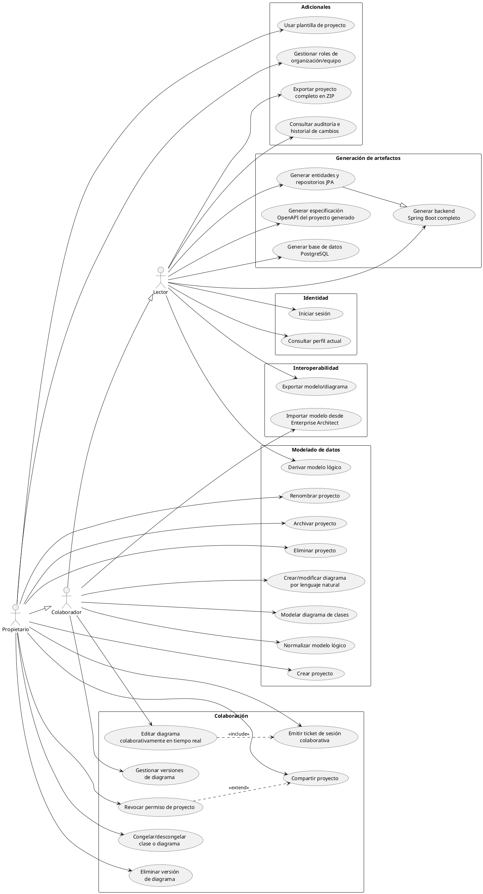

# Casos de uso de ApollonCASE

## 1. Introducción

Este documento describe los casos de uso de ApollonCASE a partir de los requisitos funcionales de [docs/requisitos.md](requisitos.md) y del estado real de implementación en el código (`services/extension-backend`) y en las especificaciones de `openspec/specs/`. El objetivo es dar trazabilidad completa: cada requisito funcional (RF) tiene al menos un caso de uso asociado, y cada caso de uso indica si ya está implementado, parcialmente implementado o todavía es un objetivo planificado.

## 2. Convenciones

- **ID**: identificador secuencial `UC01…`.
- **Actor**: rol mínimo necesario para ejecutar el caso de uso, según la jerarquía de permisos de proyecto `Propietario > Colaborador > Lector` (`ProjectPermissionType` en `ProjectsService`). Un actor de mayor jerarquía hereda todos los casos de uso de los actores inferiores (p. ej. un Propietario puede hacer todo lo que puede hacer un Colaborador o un Lector).
- **RF**: requisito funcional relacionado, según `docs/requisitos.md`. Los casos de uso de inicio de sesión y perfil no tienen RF propio (son soporte transversal, documentado en `openspec/specs/identity/spec.md`).
- **Estado**:
  - **Implementado**: existe en el código de `extension-backend` hoy.
  - **Parcial**: una parte del alcance del RF está implementada; el resto sigue pendiente.
  - **Planificado**: no hay código todavía; es un objetivo definido en `docs/requisitos.md` (algunos marcados allí como *por definir* o *por confirmar*).

Solo se modelan actores humanos (Propietario, Colaborador, Lector). Los sistemas externos que participan en algunos casos de uso (Keycloak, Enterprise Architect, el proveedor de IA/LLM) no se representan como actores en el diagrama; el actor sigue siendo el rol humano que inicia la acción.

## 3. Actores

| Actor | Descripción |
| --- | --- |
| **Propietario** | Rol con control total sobre un proyecto: además de todo lo que puede hacer un Colaborador, gestiona el ciclo de vida del proyecto (crear, renombrar, archivar, eliminar), comparte/revoca permisos y elimina versiones. |
| **Colaborador** | Puede editar el contenido de los diagramas de un proyecto (crear diagramas, modificar su cuerpo, gestionar versiones) además de todo lo que puede hacer un Lector. No puede gestionar el proyecto ni sus permisos. |
| **Lector** | Acceso de solo lectura: consulta proyectos, diagramas, su historial de versiones y artefactos generados a partir de ellos. |

## 4. Diagrama general de casos de uso

> El diagrama omite las flechas heredadas por generalización (p. ej. Propietario también puede ejecutar todos los casos de uso de Lector y Colaborador) para mantenerlo legible; esa herencia queda expresada por las relaciones `Colaborador --|> Lector` y `Propietario --|> Colaborador`.

## 5. Listado de casos de uso

### 5.1 Identidad (soporte transversal, sin RF propio)

| ID | Nombre | Actor | RF | Estado | Descripción |
| --- | --- | --- | --- | --- | --- |
| UC01 | Iniciar sesión | Lector | — | Implementado | Autenticación OIDC contra Keycloak; `extension-backend` valida el JWT en cada petición y crea/localiza al `User` local de forma idempotente (`CurrentUserFilter`, `UsersService`). |
| UC02 | Consultar perfil actual | Lector | — | Implementado | Devuelve los datos del usuario autenticado resueltos desde el JWT. `GET /api/v1/me` (`UsersController`). |

### 5.2 Modelado de datos

| ID | Nombre | Actor | RF | Estado | Descripción |
| --- | --- | --- | --- | --- | --- |
| UC03 | Modelar diagrama de clases | Colaborador | RF001 | Implementado | Crear un diagrama y editar su cuerpo (clases, atributos, métodos, relaciones). `POST` y `PUT` de diagrama/cuerpo en `ProjectsController`. |
| UC04 | Derivar modelo lógico | Lector | RF002 | Planificado | Derivar tablas, claves y relaciones a partir del modelo conceptual. No existe código todavía. |
| UC05 | Normalizar modelo lógico | Colaborador | RF003 | Planificado | Detectar incumplimientos de formas normales y proponer o aplicar la corrección. No existe código todavía. |
| UC06 | Crear proyecto | Propietario | RF004 | Implementado | Crea un proyecto y asigna automáticamente al creador como `OWNER`. `POST /api/v1/projects`. |
| UC07 | Renombrar proyecto | Propietario | RF004 | Implementado | Actualiza nombre/descripción del proyecto. `PATCH /api/v1/projects/{projectId}`. |
| UC08 | Archivar proyecto | Propietario | RF004 | Planificado | No existe un estado de archivado ni endpoint asociado en el código actual. |
| UC09 | Eliminar proyecto | Propietario | RF004 | Implementado | Elimina el proyecto y en cascada sus diagramas. `DELETE /api/v1/projects/{projectId}`. |
| UC10 | Crear/modificar diagrama mediante lenguaje natural | Colaborador | RF005 | Planificado | Edición asistida por IA (texto/voz) con confirmación previa (RNF002) y ejecución local (RNF004). No existe código todavía. |

### 5.3 Interoperabilidad

| ID | Nombre | Actor | RF | Estado | Descripción |
| --- | --- | --- | --- | --- | --- |
| UC11 | Importar modelo desde Enterprise Architect | Colaborador | RF006 | Planificado | Conversión de modelos exportados de Enterprise Architect (XMI) a diagramas de Apollon. Aparece como componente `ea-importer` en la arquitectura C4, pero sin código en `extension-backend`. |
| UC12 | Exportar modelo/diagrama | Lector | RF007 | Planificado | Exportar un modelo o diagrama para su uso en otras herramientas. No existe código todavía. |

### 5.4 Generación de artefactos

| ID | Nombre | Actor | RF | Estado | Descripción |
| --- | --- | --- | --- | --- | --- |
| UC13 | Generar base de datos PostgreSQL | Lector | RF008 | Planificado | Generar scripts DDL y migraciones a partir del modelo. No existe código todavía. |
| UC14 | Generar entidades y repositorios JPA | Lector | RF009 | Implementado | Convierte un diagrama de clases en un proyecto Spring Boot descargable (entidades `@Entity` y repositorios `JpaRepository`), sin servicios, controladores ni DTOs. `GET .../diagrams/{diagramId}/generate`, paquete `codegen` (`CodeGenerationService`). |
| UC15 | Generar backend Spring Boot completo | Lector | RF009 | Parcial | Alcance completo del RF009 (servicios, controladores REST, DTOs, validaciones, configuración); hoy solo está cubierto el subconjunto de UC14. |
| UC16 | Generar especificación OpenAPI del proyecto generado | Lector | RF010 | Planificado | Generar el OpenAPI de la API que produciría el backend generado (RF009), no el de `extension-backend` en sí (que ya expone su propio OpenAPI vía `OpenApiConfig` para fines de documentación de su propia API). |

### 5.5 Colaboración

| ID | Nombre | Actor | RF | Estado | Descripción |
| --- | --- | --- | --- | --- | --- |
| UC17 | Emitir ticket de sesión colaborativa | Propietario | RF011 | Implementado | Genera un ticket de un solo uso y 30s de validez para autorizar una conexión WebSocket de colaboración. `POST .../diagrams/{diagramId}/ws-ticket` (`WsTicketService`). |
| UC18 | Editar diagrama colaborativamente en tiempo real | Colaborador | RF011 | Implementado | Conexión WebSocket (`/ws/diagrams`) autorizada por ticket, retransmitida hacia `diagrams-backend` (`DiagramRelayHandler`). |
| UC19 | Compartir proyecto | Propietario | RF012 | Implementado | Invita a otro usuario por email, otorgando rol `COLLABORATOR` o `VIEWER`. `POST /api/v1/projects/{projectId}/share`. |
| UC20 | Revocar permiso de proyecto | Propietario | RF012 | Planificado | No se encontró endpoint de revocación de permisos en el código actual. |
| UC21 | Congelar/descongelar clase o diagrama | Propietario | RF013 | Planificado | Impedir la modificación de una clase o diagrama hasta que se descongele. No existe código todavía. |
| UC22 | Gestionar versiones de diagrama | Colaborador | RF014 | Implementado | Crear, listar, consultar, restaurar y renombrar versiones de un diagrama (proxy a `diagrams-backend` vía `DiagramsBackendClient`). |
| UC23 | Eliminar versión de diagrama | Propietario | RF014 | Implementado | `DELETE .../versions/{versionId}`. |

### 5.6 Adicionales

| ID | Nombre | Actor | RF | Estado | Descripción |
| --- | --- | --- | --- | --- | --- |
| UC24 | Consultar auditoría e historial de cambios | Lector | RF015 | Planificado | Auditoría por usuario y por proyecto. No existe código todavía. |
| UC25 | Exportar proyecto completo en ZIP | Lector | RF016 | Planificado | Exportar todos los diagramas y el código generado de un proyecto en un único ZIP (distinto del ZIP de UC14, que solo cubre un diagrama). No existe código todavía. |
| UC26 | Usar plantilla de proyecto | Propietario | RF017 | Planificado | Crear un proyecto a partir de una plantilla predefinida. No existe código todavía. |
| UC27 | Gestionar roles de organización/equipo | Propietario | RF018 | Planificado | Roles a nivel de organización o equipo, por encima de los permisos por proyecto. No existe código todavía. |
