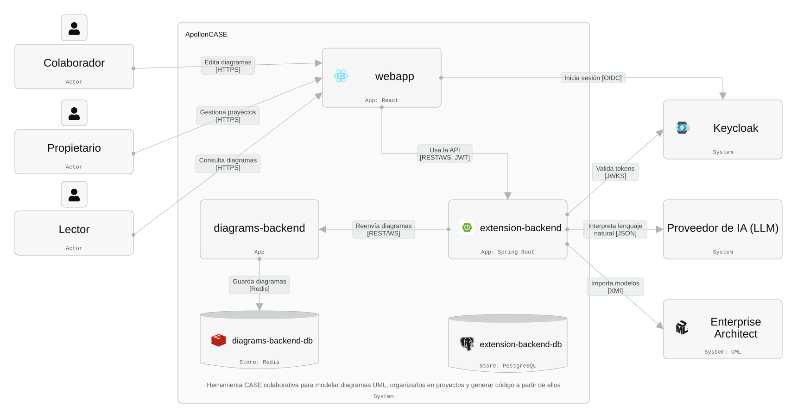
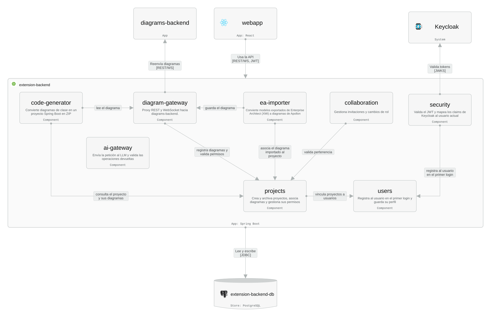

# extension-backend

Backend **Spring Boot + PostgreSQL** que incorpora las funciones nuevas de ApollonCASE (ver el [Roadmap](../../README.md#roadmap-de-extensión)) y trabaja junto al servidor de Apollon, [`diagrams-backend`](../diagrams-backend/README.md), que sigue siendo el responsable de los diagramas y la colaboración en tiempo real sobre Redis. El código y la documentación OpenAPI de este servicio están en inglés.

Se despliega mediante el `Dockerfile` de esta carpeta y `docker/compose.production.yml` de la raíz del repositorio, siguiendo el patrón de gateway (opción A, ver más abajo): es, junto con la webapp, el único servicio pensado para recibir un dominio público desde la plataforma de despliegue (ese compose no incluye proxy inverso propio, p. ej. se despliega detrás de Dokploy).

## Responsabilidades

- **Identidad:** validación de los tokens JWT emitidos por **Keycloak** (OpenID Connect).
- **Proyectos y permisos:** modelo *Proyecto → Diagramas* y permisos por usuario (propietario, colaborador y solo lectura, refinados por proyecto y por diagrama) en PostgreSQL, que es la fuente de verdad de usuarios, proyectos, permisos y del mapeo `diagramId ↔ proyecto`.
- **Puerta de entrada a los diagramas:** proxy de la API REST y del WebSocket de `diagrams-backend` aplicando esos permisos.
- **Generación de código:** proyecto Spring Boot completo (con OpenAPI) a partir de diagramas de clase.
- **Modelado asistido e importación:** lenguaje natural o voz para crear diagramas e importación desde Enterprise Architect (por definir).

## Arquitectura de integración

`diagrams-backend` **no se modifica**. No tiene autenticación: el `diagramId` actúa como una capacidad (quien lo conoce puede leer, escribir y borrar el diagrama y unirse a su sala), la cookie de propietario es solo "fricción, no seguridad" y el relay WebSocket no distingue lectores de editores. Con permisos por usuario no puede quedar expuesto: en producción vive en una red Docker privada (`apollon-internal`) y todo acceso pasa por este servicio.

Componentes internos de este servicio:

La webapp apunta `VITE_EXTENSION_SERVER_URL` (y su WebSocket derivado, ver `webapp/src/constants/urls.ts`) a este servicio y envía el token; `library` y `diagrams-backend` no cambian.

## Exposición de la API de diagramas

Alternativas evaluadas para que los usuarios carguen y editen diagramas sin acceder directamente a `diagrams-backend`:

| | **A. Gateway/BFF en este servicio** (Spring proxya REST y WS) | **B. Proxy de borde con *forward-auth*** (Traefik/Nginx consulta a este servicio) | **C. Reimplementar la API** y hablar con Redis directamente |
| --- | --- | --- | --- |
| Punto de entrada público | Único (este servicio) | El proxy de borde; `diagrams-backend` detrás | Único |
| Cambios en `diagrams-backend` | Ninguno | Ninguno | Ninguno |
| Lectura vs. edición en tiempo real | **Sí**: el proxy WS descarta los frames de escritura de los lectores y cierra los sockets al revocar el permiso | **Solo al conectar**: un lector conectado puede enviar ediciones y una revocación no corta los sockets vivos | Habría que reescribir el relay Yjs/WS en la JVM |
| Coste y latencia | Salto extra; el tráfico Yjs pasa por la JVM (mitigable con stack reactivo/Netty) | Mínimo: el payload va directo a Node | Alto (reimplementación) |
| Acoplamiento con Apollon | Contrato HTTP/WS estable (`/api/diagrams`, `/versions`, `?diagramId=`) | Igual | **Alto**: claves Redis, RedisJSON y función Lua `apollon`; se rompe al actualizar Apollon |
| Complejidad | Media (proxy WS con filtrado) | Baja–media | Alta |
| Cookie de propietario | El gateway puede acuñarla (comparte `OWNER_SECRET` por configuración) y filtrar `Set-Cookie` | Hay que reenviarla al navegador | No aplica |
| Superficie pública | Lista blanca explícita de rutas (no se exponen `/api/converter/*` ni `/health`) | Reglas por ruta en el proxy | Solo lo reimplementado |

**Recomendación: opción A**, porque es la única que impone lectura y edición y la revocación en vivo sin modificar Apollon ni depender de su esquema de Redis. Consideraciones:

- **Creación:** el gateway llama a `POST /api/diagrams`, recibe el `id` y registra `diagramId ↔ proyecto` (y propietario) en PostgreSQL en la misma operación.
- **Filtrado de WebSocket:** los frames son JSON `{ "diagramData": "<base64>" }`; el primer byte decodificado distingue el awareness (tipo `3`, permitido a los lectores) de las actualizaciones del documento (descartadas para lectores).
- **Rendimiento:** el relay admite 100 sockets por sala y 1 MiB por frame; hay que probar la carga del proxy WS.
- **Plan alternativo:** si el proxy WS no rinde, un híbrido A+B (REST por el gateway; WS con un ticket de un solo uso emitido por este servicio y validado por un proxy de borde), aceptando la limitación de lectura vs. edición.

### Decisiones abiertas

- **Caducidad de los diagramas:** en Redis caducan a los 120 días (`DIAGRAM_TTL_SECONDS`, deslizante al leer). Como PostgreSQL será la fuente de verdad de la pertenencia, conviene decidir si se hace un snapshot periódico de cada diagrama (vía `GET` interno) o se renueva su TTL para no perder diagramas inactivos.
- **Diagramas actuales y acceso anónimo:** los diagramas "sueltos" compartidos por enlace dejan de ser accesibles fuera del gateway. Hay que decidir si se migran a proyectos, si se conserva un modo anónimo y cómo se sirven `/embed/:id` y las vistas previas.
- **Conversión (`/api/converter/*`):** se expone solo autenticada y con límites, o no se expone.
